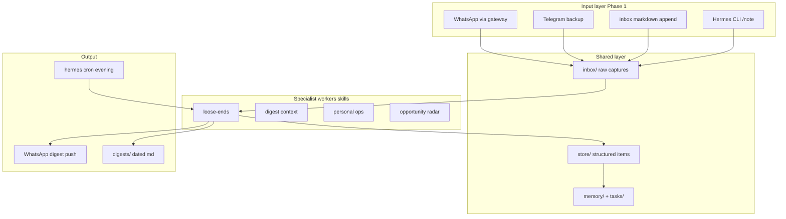
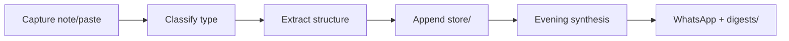

# Hermes life bot — multi-mode plan

## Principles (from your brief)

- **One system:** shared inbox + memory + scheduler; specialist “workers” are Hermes **skills** (and later **skill bundles**), not separate repos or agents.
- **Narrow and boring:** 70% correct is fine; reduce entropy, don’t build “autonomous CEO.”
- **Phase 1 = manual friction:** you forward/drop/note; the agent classifies, extracts commitments, and synthesizes on a schedule.
- **Defer:** OAuth email, Slack ingestion, browser plugins, embeddings/vector DB (optional Phase 2).

Your existing scaffold in [2-hermes-life-bot](2-hermes-life-bot) (`instructions/`, `memory/`, `tasks/`) is still useful—we **extend** it rather than replace it wholesale. Hermes natively loads workspace rules from **`AGENTS.md`** (not only `instructions/README.md`), so Phase 1 should add/consolidate that file.

---

## Target architecture



**Classifier/router (lightweight):** not a separate service in v1. Each skill’s `SKILL.md` instructs the agent to read `inbox/` + `store/`, classify new items, and write structured rows. A future **router skill** can dispatch to specialists when prompts get messy.

**Slash commands (your UX):**

| Command | Mode | Phase |
| --- | --- | --- |
| `/loose-ends` | Commitment review + open loops | **Build first** |
| `/digest` | Morning context compression | Stub → Phase 2 |
| `/ops` | Life admin checks | Stub → Phase 3 |
| `/radar` | Opportunity scan | Stub → Phase 4 |

Implement via Hermes **skill bundles** (`hermes bundles create …`) so `/loose-ends` loads the loose-ends skill + shared “life-core” skill in one shot. Stub bundles can reply with “not wired yet.”

---

## Repo layout (incremental)

Keep and extend current paths:

| Path | Role |
| --- | --- |
| [`AGENTS.md`](2-hermes-life-bot/AGENTS.md) | Hermes workspace brain: shared rules, where to read/write, safety |
| [`inbox/`](2-hermes-life-bot/inbox/) | Append-only raw captures (`YYYY-MM-DD.md` or single `inbox.md`) |
| [`store/`](2-hermes-life-bot/store/) | Structured extractions (`commitments.jsonl` or `items.yaml`) |
| [`digests/`](2-hermes-life-bot/digests/) | Written evening/morning outputs (audit trail + re-read) |
| [`memory/`](2-hermes-life-bot/memory/) | Stable context (preferences, people, projects) |
| [`memory/paths.md`](2-hermes-life-bot/memory/paths.md) | External TODO markdown paths loose-ends/digest may read (you maintain the list) |
| [`tasks/`](2-hermes-life-bot/tasks/) | Human-facing active/backlog ([`active.md`](2-hermes-life-bot/tasks/active.md) stays) |
| [`skills/`](2-hermes-life-bot/skills/) | Workspace-local `SKILL.md` files per mode |
| [`instructions/`](2-hermes-life-bot/instructions/) | Optional human docs; can mirror or link from `AGENTS.md` |
| [`Plans/project-plan.md`](2-hermes-life-bot/Plans/project-plan.md) | Replace draft with this overview + per-mode sections |

**Structured item shape (v1, simple):**

```json
{
  "id": "uuid-or-slug",
  "type": "follow_up|task|idea|commitment|expense|research",
  "text": "original wording",
  "topic": "VAT invoice",
  "time_hint": "next week",
  "urgency": "low|medium|high",
  "status": "open|done|snoozed",
  "source": "whatsapp|telegram|cli|markdown",
  "created_at": "ISO8601",
  "last_seen_at": "ISO8601"
}
```

No embeddings in v1—the evening skill clusters by **topic keywords + recurrence** in the prompt. Phase 2 optional: embed + cluster for richer “mentioned six times” detection.

**Classification types** (shared across modes when capturing):

`task` · `commitment` · `follow_up` · `idea` · `expense` · `subscription` · `bug` · `travel` · `research topic`

---

## Mode 1 — Loose ends (`/loose-ends`) — build first

### Purpose

Personal async **memory + follow-up tracker**. Surfaces commitments humans leak: things you said you’d do, threads you opened and abandoned, topics you keep mentioning without closing. Disproportionately valuable because follow-through decays silently—not because the model needs to be clever.

**Tone:** factual, low guilt. Not a coach; a mirror.

### What it watches (by phase)

| Source | Phase 1 (your choices) | Later (explicit defer) |
| --- | --- | --- |
| WhatsApp / Telegram | Primary capture + evening push | — |
| This workspace | `inbox/`, `store/`, `tasks/active.md` | — |
| Pasted content | Email snippets, Slack/Discord excerpts, issue URLs, “4 tabs on X” notes | — |
| External TODO markdown | Paths listed in [`memory/paths.md`](2-hermes-life-bot/memory/paths.md) (you maintain) | Auto-watch without listing |
| Starred email, Slack/Discord APIs | — | OAuth / bots when worth it |
| Calendar | — | Read-only calendar notes |
| GitHub issues idle N days | — | API or manual paste in v1 only |
| Browser tabs | — | Extension or paste-only |

**Priority themes** when clustering/synthesis (surface in digest if recurring): **Claude Code / agent experiments**, **side-project drift**. Other themes (podcast outreach, architecture docs, Orkestro/logistics) still captured as normal topics—no special section unless you add them to `memory/paths.md` or they hit recurrence rules.

### Processing pipeline



1. **Capture** — `note: …` on WhatsApp (primary) or Telegram; CLI; append to `inbox/YYYY-MM-DD.md`.
2. **Classify** — map to shared types above; reject/trading-only content per `AGENTS.md`.
3. **Extract structure** — e.g. input `Need to chase that VAT invoice next week` → `follow_up`, topic `VAT invoice`, `time_hint: next week`, `urgency: medium`.
4. **Store** — append `store/commitments.jsonl`; update `last_seen_at` on duplicate topics.
5. **Periodic synthesis** — **8:00 PM Europe/Lisbon** cron + on-demand `/loose-ends`.

### Digest heuristics (v1)

- **Stale:** open items with no update for **7 days** (flag as idle; your “11 days on issue” example becomes Phase 2 with GitHub).
- **Recurrence:** same `topic` **3+** times in 14 days without `done`.
- **Overdue hints:** `time_hint` parsed as in the past (best-effort; don’t over-parse).
- **Theme nudge:** if topic tags match Claude Code experiments or side projects, group under a short subheading.
- **Volume:** 3–7 bullets evening; link to `digests/YYYY-MM-DD-evening.md` for detail.

**Example evening lines** (style target):

- “You mentioned chasing the VAT invoice but never followed up.”
- “You said you’d send the podcast guest list — 9 days open.”
- “You’ve noted ‘Hermes hosting costs’ four times this week.”
- “Side project X: last capture 8 days ago, no done marker.”

### Chat actions (your choice: prefixes + files)

| Action | WhatsApp/Telegram | Files |
| --- | --- | --- |
| Capture | `note: …` | Append `inbox/` |
| Review now | `review` or `/loose-ends` | — |
| Done | `done: <topic or id>` | Edit `store/` row `status: done` |
| Snooze | `snooze: <topic> 7d` | Set `status: snoozed`, `snooze_until` |

Skill must apply chat actions to `store/` and mirror into `tasks/active.md` when it’s a top-level priority.

### Scheduled delivery

- **Cron:** `0 20 * * *` in **Europe/Lisbon** → WhatsApp push + `digests/YYYY-MM-DD-evening.md`.
- **Telegram:** backup capture only unless you later add deliver target.

### Phase 2+ (documented, not built now)

- Embeddings + cluster for “merchant reconciliation” style topic gravity.
- GitHub idle-issue watcher; starred Gmail; Slack DM forwarder.
- Lightweight daily digest variant (overlap with `/digest`—keep loose-ends focused on **commitments**, not full context).

### Loose ends success criteria

- `note:` on WhatsApp → inbox line + `store/` row in one session.
- `/loose-ends` references real open rows only.
- 8pm Lisbon: WhatsApp summary + digest file.
- `done:` / `snooze:` update store correctly.

---

## Mode 2 — Daily context compression (`/digest`)

### Purpose

**Externalized working memory** — anti-fragmentation for people juggling multiple repos, side projects, AI experiments, content, and business ideas. Not surveillance; a **continuity engine** that reconstructs what you cared about, where you left off, unresolved decisions, and repeated distractions.

Think: inspiration for a diary, but operational—“state of your life/work” in ~5 minutes.

### What it observes (by phase)

| Signal | Phase 1 | Phase 2+ (your breadcrumb priorities) |
| --- | --- | --- |
| Manual paste / `note:` | “What I did today”, commits, issue links | — |
| `inbox/` + prior loose-ends digest | Yes | Yes |
| TODO markdown | — | Paths in `memory/paths.md` |
| Browser tab titles | — | **Paste occasionally** (no extension v1) |
| Voice / messages-to-self | — | **Transcribe or paste** into inbox |
| Git commit messages across repos | — | Deferred (not in your breadcrumb pick) |
| Full screen / keystroke / giant vector DB | — | **Never** |

**Principle:** capture **breadcrumbs**, not everything. Enough to reconstruct momentum after context switches.

### Output (when built)

- **Schedule:** **8:00 AM Europe/Lisbon** cron (after loose-ends is stable); on-demand `/digest` from day one as stub.
- **Format:** short sections — *Yesterday’s thread* · *Paused work* · *Open decisions* · *Likely blocker* · *One suggested next action*.
- **File:** `digests/YYYY-MM-DD-morning.md` + optional WhatsApp (decide at implement time; default file + push if cheap).

**Example morning brief** (style target):

- “You were debugging Docker networking.”
- “You paused the frontend component library PRD.”
- “You intended to compare Hermes hosting costs.”
- “Open issue likely blocking progress: auth duplication.”

### Relationship to loose-ends

- **Loose-ends** = commitments and follow-ups you owe.
- **Digest** = narrative continuity and “where your head was.”
- Shared `inbox/` and `memory/paths.md`; digest **reads** yesterday’s evening digest but does not duplicate commitment logic.

### Phases

| Phase | Scope |
| --- | --- |
| Stub | `/digest` explains not wired; points to manual morning read of `digests/` |
| 1 | Prompt-only synthesis from inbox + tasks + pasted breadcrumbs |
| 2 | Read TODO files from `memory/paths.md`; template for tab-title paste (`tabs: …`) and voice paste (`voice: …`) |
| 3 | Optional git-log script for allowed repos (read-only) |

---

## Mode 3 — Personal operations (`/ops`)

### Purpose

Tiny **life admin operator** — unglamorous, high leverage. Removes annoying maintenance; failures are costly; automation can grow incrementally forever.

**Design:** checklist + last-run dates, not an autonomous bill payer.

### Categories (phased)

| Category | Your v1 focus | Later examples from brief |
| --- | --- | --- |
| **Visa / passport expiry** | First checklist | Remind N months before |
| **Machine backup** | First checklist | “Haven’t backed up in 18 days” |
| Subscriptions / SaaS dupes | — | Spike detection, duplicate tools |
| Recurring bills | — | Track due dates |
| Invoicing (“invoice people”) | — | Manual log |
| Flights/trains, FX | — | Price watches if you move money internationally |

### Behavior

- **Cadence:** **monthly** scan by default once wired; on-demand `/ops` anytime.
- **Storage:** `tasks/routines/ops.md` — items with `last_checked`, `next_due`, `notes`.
- **Output:** short monthly WhatsApp or file digest: only items due or overdue; no wall of text.
- **Risk profile:** low — read workspace files, no send-email actions in v1.

### Phase 1 stub

Skill returns checklist template and instructions to fill `ops.md`; no cron until data exists.

### Phase 2

Skill diffs dates vs today; cron monthly (e.g. 1st of month 9am Lisbon); optional `ops: checked backup` chat prefix.

---

## Mode 4 — Opportunity radar (`/radar`)

### Purpose

Always-on **adjacent opportunity scanner** — novelty and leverage without becoming a Twitter firehose. Filters aggressively: only **actionable**, **unusual**, or **economically relevant** items.

**Anti-pattern:** 20-link newsletters. **Target:** max **5 items/day** in digest.

### Scoring interests (confirmed)

Rank candidates against:

1. **Local agents / Hermes / hosting & infra cost** (e.g. cheaper model routes)
2. **Coding agents** (Claude, Cursor, tooling shifts)
3. **Trending AI agent repos on GitHub**

Secondary (capture in `memory/interests.md`, lower weight until you promote): podcast sponsorship, logistics/merchant news, Nimblist-style product updates.

**Example hits** (style target):

- “OpenRouter added cheaper DeepSeek variant — may cut always-on Hermes cost ~62%.”
- “Three podcasts like yours started ads from the same AI startup.”

Each item must include: **why you care** · **suggested action** (read / try / ignore) · **confidence**.

### MVP feeds (weekend-scale, Phase 2)

| Feed | Use |
| --- | --- |
| Hacker News | Top / filtered by keywords |
| GitHub trending | AI/agent repos |
| Curated Twitter/X lists | Manual list export or RSS where available—not full firehose |

**Not in MVP:** inbox-only mode alone (you also want automated fetch). Provider changelogs can be Phase 3.

### Phases

| Phase | Scope |
| --- | --- |
| Stub | `/radar` + `memory/interests.md` template |
| MVP | Daily cron, fetch 2–3 feeds, score, max 5 bullets, `digests/YYYY-MM-DD-radar.md` |
| Later | Podcast/logistics sources; economic relevance threshold tuning |

### Risks

- **Addictive novelty** — hard cap 5 items; require actionable field; weekly “ignore list” in interests file.
- **Permissions** — public web only; separate from personal inbox if prompts get messy.

---

## Four modes — command & schedule summary

| Command | Mode | Default schedule (Europe/Lisbon) | Deliver |
| --- | --- | --- | --- |
| `/loose-ends` | Follow-ups | **20:00 daily** + on-demand | WhatsApp |
| `/digest` | Context | **08:00 daily** (when built) | TBD (file + optional WA) |
| `/ops` | Life admin | **Monthly** (when built) | File or WA |
| `/radar` | Opportunities | Daily when built (time TBD) | File or WA |

---

## Hermes wiring (concrete)

You run Hermes with CWD = [2-hermes-life-bot](2-hermes-life-bot) ([README](2-hermes-life-bot/README.md)).

### Workspace

- Add **`AGENTS.md`**: shared behavior (read `inbox/`, `store/`, `tasks/active.md`; never delete without ask; no trading).
- Install/link workspace skills from `skills/` (Hermes scans skill source dirs; confirm with `hermes skills list` after adding repo path or copy skills to `~/.hermes/skills/`).

### Skills to add

- `skills/life-core/SKILL.md` — capture protocol, file paths, classification schema, write rules.
- `skills/loose-ends/SKILL.md` — review + digest format; dedupe against `store/`.
- Stubs: `skills/digest`, `skills/ops`, `skills/radar` (one-liner “Phase N”).

### Bundles

```bash
hermes bundles create loose-ends --skill life-core --skill loose-ends -d "Follow-up review"
# Later: digest, ops, radar bundles
```

In chat: `/loose-ends` runs evening review on demand.

### Messaging (your choices)

- **Primary capture + digest delivery:** **WhatsApp** (`hermes whatsapp`, gateway running).
- **Backup:** Telegram (already configured)—same capture phrasing, e.g. prefix `note:` vs `review:`.
- Gateway must be running (`hermes gateway status` / `hermes gateway run` in tmux if needed).

### Scheduled evening digest

```bash
hermes cron create "loose-ends-evening" \
  --schedule "0 20 * * *" \
  --timezone "Europe/Lisbon" \
  --prompt "Run loose-ends evening review per AGENTS.md. Read inbox/, store/, tasks/active.md, memory/paths.md. Stale=7d. Priority themes: Claude Code experiments, side-project drift. Write digests/YYYY-MM-DD-evening.md and summarize for WhatsApp." \
  --deliver whatsapp \
  --skill loose-ends,life-core
```

(Exact flags: confirm with `hermes cron create --help` on your install; delivery target names may be `whatsapp` or platform-specific—verify once when implementing.)

Use `hermes -z` in scripts only if you need silent one-shot runs; cron job is the main path.

### Capture conventions (low friction)

- WhatsApp/Telegram: `note: Need to chase VAT invoice next week` → append inbox + extract to store.
- `done: VAT invoice` · `snooze: podcast outreach 14d` → update `store/`.
- `review` or `/loose-ends` → immediate digest.
- CLI: `hermes chat -s life-core -q "note: …"` from workspace dir.
- Paste anything (issue URL, email snippet, tab list) as `note:` body—no separate integration required.

---

## Phase 1 implementation order (loose-ends only)

1. **Shared schema** — `inbox/`, `store/`, `digests/`, `memory/paths.md`, sample `commitments.jsonl`, document capture format in `AGENTS.md`.
2. **`life-core` + `loose-ends` skills** — classify/extract on note; review template for digests.
3. **`/loose-ends` bundle** — test on-demand review in CLI, then WhatsApp.
4. **Gateway capture test** — send `note:` on WhatsApp; confirm files update in workspace.
5. **Evening cron** — push digest to WhatsApp + write `digests/` file.
6. **Stub bundles** for `/digest`, `/ops`, `/radar` — friendly “not yet” message.
7. **Update** [`Plans/project-plan.md`](2-hermes-life-bot/Plans/project-plan.md) with per-mode sections and “done / next” checklist.

**Explicitly out of scope for Phase 1:** embeddings DB, email/Slack APIs, browser extension, separate agents, git re-init.

---

## When to split into separate agents later

Only if you need divergent **permissions** (email write vs read-only web), **schedules**, or **privacy boundaries** (radar public-only vs personal inbox). Until then, one gateway + one workspace + skill modes is correct.

---

## Success criteria for “loose-ends operational”

- You can send a WhatsApp `note:` and see a new line in `inbox/` + structured row in `store/` within one session.
- `/loose-ends` produces a digest referencing real open items (not hallucinated tasks).
- **8:00 PM Europe/Lisbon** cron pushes a short WhatsApp summary and writes `digests/YYYY-MM-DD-evening.md`.
- `done:` / `snooze:` in chat and manual `store/` edits both work.
- Items in `memory/paths.md` TODO files are mentioned when you’ve captured or pasted related context (full file watch is Phase 2).

---

## Using this plan later

Each mode section above is the **base spec** for a focused implementation plan. Suggested order: loose-ends (Phase 1 implementation todos) → digest stub + Phase 1 prompt → ops checklist → radar MVP feeds. Copy the relevant mode section into a new plan file when you start that agent; do not re-derive requirements from scratch.
