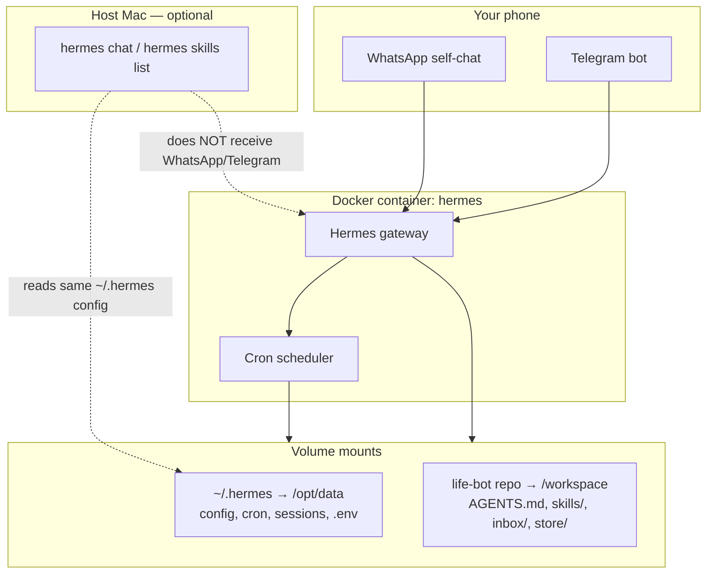

# Docker deployment guide

This is the canonical guide for how the life-bot runs in production on your machine. WhatsApp and Telegram talk to the **Docker gateway**, not the host `hermes` CLI session.

## Architecture



| Component | Where it lives | What it does |
| --- | --- | --- |
| **Gateway** | Docker container `hermes` | Handles WhatsApp, Telegram, and cron. This is the agent you message. |
| **Workspace** | Repo mounted at `/workspace` | `AGENTS.md`, skills, inbox, store, digests — the agent's brain and memory. |
| **Hermes data** | `~/.hermes` → `/opt/data` | Config, API keys, cron jobs, sessions, WhatsApp bridge state. |
| **Host CLI** | `hermes` on your Mac | Useful for testing skills and config. **Not** connected to WhatsApp/Telegram unless you also run a host gateway (don't). |

### What the agent reads on each message

When you send a WhatsApp or Telegram message, the gateway:

1. Loads **`AGENTS.md`** from `/workspace` (via `terminal.cwd: /workspace` in config).
2. Applies **`channel_prompts`** for your home chat (life-bot role summary).
3. Can invoke **skills** from `/workspace/skills/` (via `skills.external_dirs`).
4. Uses **file tools** rooted at `/workspace` — so it reads/writes `inbox/`, `store/`, `digests/` in this repo.

Cron jobs (`loose-ends-evening`) use the same workspace via `workdir: /workspace` in `~/.hermes/cron/jobs.json`.

---

## First-time setup

Run once after cloning or on a new machine.

### 1. Start the container

Replace the repo path with yours:

```bash
docker run -d \
  --name hermes \
  --restart unless-stopped \
  -v "$HOME/.hermes:/opt/data" \
  -v "/Users/samjam/Code/bot-bot-bot/2-hermes-life-bot:/workspace" \
  -w /workspace \
  nousresearch/hermes-agent:latest \
  gateway run
```

**Important:** Only one gateway should run. If you previously used `hermes gateway run` on the host, stop it — two gateways fight over WhatsApp/Telegram.

```bash
# Check nothing else is listening
hermes gateway status    # host — should be stopped / not running
docker ps | grep hermes  # container — should be Up
```

### 2. Configure messaging in `~/.hermes/.env`

Required keys (see [whatsapp-docker-setup.md](whatsapp-docker-setup.md) for WhatsApp details):

```bash
TELEGRAM_BOT_TOKEN=...
TELEGRAM_HOME_CHANNEL=<your-telegram-user-id>
WHATSAPP_ENABLED=true
WHATSAPP_HOME_CHANNEL=<your-jid>   # often ends in @lid for self-chat
WHATSAPP_MODE=self-chat
TERMINAL_ENV=local                 # required inside Docker (no nested Docker)
```

Then restart: `docker restart hermes`

### 3. Wire skills and workspace

Host-path symlinks (`install-skills.sh`) **do not work inside Docker**. Run:

```bash
cd /Users/samjam/Code/bot-bot-bot/2-hermes-life-bot
./scripts/setup-docker-gateway.sh
```

This sets `skills.external_dirs`, `terminal.cwd`, channel prompts, timezone, and cron workdir.

### 4. Create the evening cron job

```bash
./scripts/setup-cron.sh
```

Uses `/workspace` as workdir automatically when the `hermes` container is running.

### 5. Verify

```bash
docker logs -f hermes                          # WhatsApp bridge connected
hermes skills list | grep -E 'life-core|loose-ends'   # skills found
```

On WhatsApp or Telegram, send:

```text
What do you do?
```

You should get an answer about life-bot, `note:`, loose-ends — not a generic Hermes assistant.

---

## Coming back after a break

Quick checklist — no need to redo full setup.

```bash
# 1. Is the container running?
docker ps --filter name=hermes

# 2. If not, start it (same command as first-time setup, or just start existing container)
docker start hermes

# 3. Check logs
docker logs hermes 2>&1 | tail -20

# 4. Confirm skills still resolve
hermes skills list | grep -E 'life-core|loose-ends'

# 5. Ping the agent
#    WhatsApp/Telegram: "note: back after break"
```

If skills are missing or the agent answers generically, re-run:

```bash
./scripts/setup-docker-gateway.sh
```

Common causes after time away: config drift, container recreated without volume mounts, or a host gateway accidentally started.

---

## Local CLI vs the live agent

| | **Docker gateway** (WhatsApp/Telegram) | **Host `hermes chat`** |
| --- | --- | --- |
| Receives your messages | Yes | No |
| Workspace path | `/workspace` | Host repo path (if configured) |
| Same session as phone | Yes | No — separate CLI session |
| Use for | Production capture + cron | Quick local testing |

### Talk to the live agent

Use **WhatsApp** (primary) or **Telegram** (backup). That is always the Docker gateway.

### Test locally without messaging

To approximate production behaviour on the host:

```bash
cd /Users/samjam/Code/bot-bot-bot/2-hermes-life-bot
hermes chat -s life-core,loose-ends
```

Or one-shot:

```bash
hermes chat -s life-core,loose-ends -m "note: test from CLI"
```

The host CLI reads the same `~/.hermes/config.yaml` but uses host filesystem paths. For a faithful test of what WhatsApp sees, message WhatsApp directly.

### Do not run two gateways

| Symptom | Likely cause |
| --- | --- |
| Messages ignored or duplicated | Host gateway + Docker gateway both running |
| "Gateway is not running" from host CLI | Normal — gateway is in Docker, not on host |
| Cron doesn't fire | Container stopped, or `docker ps` shows no `hermes` |

---

## Deploying updates that affect the live agent

Most changes live in the **repo mount**. The container reads `/workspace` directly — no image rebuild needed for day-to-day work.

### What to change, and what to do after

| You changed | Affects WhatsApp/Telegram? | Action needed |
| --- | --- | --- |
| `AGENTS.md` | Yes — workspace rules | **None** (live on next message) |
| `skills/*/SKILL.md` | Yes — `/loose-ends`, cron skills | **None**, or send `/reload-skills` in chat |
| `memory/`, `tasks/`, `inbox/`, `store/` | Yes — agent context | **None** |
| `~/.hermes/config.yaml` (prompts, cwd, external_dirs) | Yes | `docker restart hermes` or `./scripts/setup-docker-gateway.sh` |
| `~/.hermes/.env` (tokens, home channels) | Yes | `docker restart hermes` |
| `~/.hermes/cron/jobs.json` or `setup-cron.sh` | Yes — scheduled digest | Restart if gateway was running during edit; or wait for next tick |
| Hermes **Docker image** (`nousresearch/hermes-agent`) | Platform/runtime only | Pull + recreate container (see below) |
| `scripts/setup-docker-gateway.sh` itself | No until you run it | Run the script after editing |

### Typical update workflow

```bash
cd /Users/samjam/Code/bot-bot-bot/2-hermes-life-bot

# 1. Edit repo files (skills, AGENTS.md, memory, etc.)
# 2. Commit to git as usual — git does NOT deploy; the mount does

# 3. If you changed ~/.hermes config:
./scripts/setup-docker-gateway.sh

# 4. Verify on WhatsApp/Telegram
#    "note: deployed skill update"
#    or: /loose-ends
```

**Git pull does not restart the agent**, but edited files are visible immediately because the repo is bind-mounted. Pull + edit = live as soon as files hit disk.

### Updating the Hermes platform image

Only needed for Hermes Agent version upgrades (new gateway features, bug fixes):

```bash
docker pull nousresearch/hermes-agent:latest
docker stop hermes && docker rm hermes

# Re-run the same docker run command from first-time setup
docker run -d \
  --name hermes \
  --restart unless-stopped \
  -v "$HOME/.hermes:/opt/data" \
  -v "/Users/samjam/Code/bot-bot-bot/2-hermes-life-bot:/workspace" \
  -w /workspace \
  nousresearch/hermes-agent:latest \
  gateway run

./scripts/setup-docker-gateway.sh   # re-apply workspace wiring if needed
./scripts/patch-whatsapp-bridge.sh # if self-chat inbound breaks again
```

Your data (`~/.hermes`) and workspace (repo) persist across image updates.

---

## Cron: evening loose-ends digest

| Setting | Value |
| --- | --- |
| Job name | `loose-ends-evening` |
| Schedule | `0 20 * * *` (20:00, timezone `Europe/Lisbon` in config) |
| Delivery | WhatsApp (override: `HERMES_CRON_DELIVER=telegram ./scripts/setup-cron.sh`) |
| Skills | `life-core`, `loose-ends` |
| Workdir | `/workspace` (must be container path, not `/Users/...`) |

Manual test:

```bash
docker exec hermes sh -c 'cd /opt/hermes && uv run hermes cron run <job-id>'
# job-id from: hermes cron list
```

Check output: `digests/YYYY-MM-DD-evening.md` in the repo, plus a WhatsApp message.

---

## Troubleshooting

| Problem | Fix |
| --- | --- |
| `Skill(s) not found: life-core, loose-ends` | Run `./scripts/setup-docker-gateway.sh` — symlinks break in Docker |
| Agent doesn't know about `note:` / life-bot | Check `terminal.cwd: /workspace` and channel prompts; re-run setup script |
| Cron can't write digest / wrong workdir | Cron `workdir` must be `/workspace`; check `~/.hermes/cron/jobs.json` |
| WhatsApp sends fail | Set `WHATSAPP_HOME_CHANNEL` in `~/.hermes/.env` |
| Self-chat messages ignored | `./scripts/patch-whatsapp-bridge.sh` |
| `execute_code` Docker errors | Set `terminal.backend: local` and `TERMINAL_ENV=local` |
| Generic Hermes personality | Re-run `setup-docker-gateway.sh`; ask "what do you do?" to verify |

Logs:

```bash
docker logs -f hermes
tail -f ~/.hermes/logs/agent.log
```

---

## File reference

| Path | Role |
| --- | --- |
| `AGENTS.md` | Workspace brain — capture protocol, review rules |
| `skills/life-core/` | Classification and commitment extraction |
| `skills/loose-ends/` | Evening review procedure |
| `inbox/`, `store/`, `digests/` | Personal data (gitignored) |
| `~/.hermes/config.yaml` | Skills dirs, cwd, channel prompts, timezone |
| `~/.hermes/.env` | API keys, Telegram/WhatsApp tokens |
| `~/.hermes/cron/jobs.json` | Scheduled jobs |
| `scripts/setup-docker-gateway.sh` | One-command fix for Docker wiring |
| `scripts/setup-cron.sh` | Create/recreate evening cron job |

See also [whatsapp-docker-setup.md](whatsapp-docker-setup.md) for WhatsApp-specific details.
